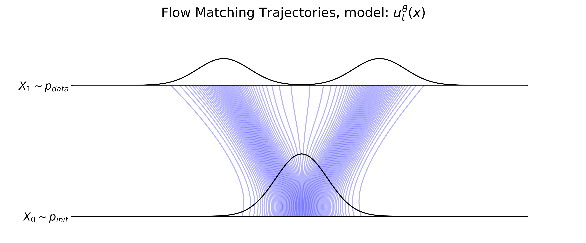
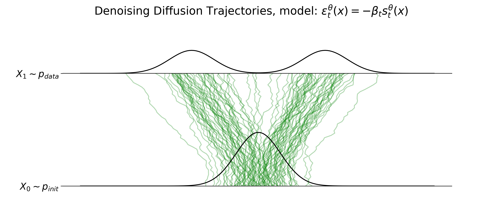

# Flow Matching and Denoising Diffusion Models

Two widely used generative AI models are flow matching and denoising diffusion, with notable examples including *Stable Diffusion 3*, *Movie Gen Video*, and *AlphaFold3*. These models generate data by iteratively transforming noise into structure, a process governed by ordinary and/or stochastic differential equations (ODEs/SDEs).

* **Flow Matching (FM)** learns an optimal transport velocity field that maps an arbitrary initial distribution $p_{\text{init}}$ to a target distribution $p_{\text{data}}$. This transformation follows a deterministic ordinary differential equation (ODE).

* **Denoising Diffusion Models (DDMs)** can be viewed as a stochastic extension of FM, where the transformation follows a stochastic differential equation (SDE) rather than an ODE. Specifically, DDMs require Gaussian initial distributions and add Gaussian noise to the data via a Brownian motion-like diffusion process (Gaussian probability paths).

## Generation as Sampling

Let's say we want to generate an image of a dog or the structure of a novel molecule. "Generation" in this context really refers to sampling from a diverse probability distribution of objects, also known as our data distribution $p_{\text{data}}$ (e.g., natural images of different animals, SMILES string representations of known molecules, etc.). Furthermore, a well-trained generative model should generate objects $z$ with high likelihood that it is under the data distribution. This  **unconditional generation** process is expressed as $z \sim p_{\text{data}}$.

In most cases though, we want to generate an object conditioned on some data $y$. In the case of image generation, $y$ might be a text prompt, $y=\text{``a dog running through the snow''}$. This **conditional generation** process is expressed as $z\sim p_{\text{data}}(\cdot |y)$, where $p_{\text{data}}(\cdot |y)$ represents the conditional data distribution.

## From Noise to Data

For both denoising diffusion and flow matching, the process of generation involves taking samples from some initial distribution $x\sim p_{\text{init}}$, where $p_{\text{init}}$ is typically modeled as an uncorrelated multivariate Gaussian $\mathcal{N}(0,I_{d})$, and transforming them into $p_{\text{data}}$. This transformation is modeled as a collection of trajectories which "flow" samples from the initial distribution to the data distribution.

# Flow Models

The objective of flow models is to learn an optimal vector field that converts samples $x \sim p_{\text{init}}$ to $z \sim p_{\text{data}}$ in space $\in\mathbb{R}^d$. We can think of a sample following a trajectory $X$ defined as,

$$
X:[0,1] \rightarrow \mathbb{R}^d, \quad t \mapsto X_{t}
$$

where $X$ follows along the lines of a vector field $u_{t}$,

$$
u:\mathbb{R}^d \times [0,1] \rightarrow \mathbb{R}^d, \quad (x,t) \mapsto u_{t}(x)
$$

Here, $t$ refers to a psuedo "time" where $t=0$ represents the beginning of our trajectory from $p_{\text{init}}$ and subsequently $t=1$, the end of the trajectory at $p_{\text{data}}$. Given our vector field and some initial condition $X_{t=0}=x_{0}$, we want to solve for our trajectory $X_{t}$ at any time $t$. What we have is a vector field defining the following ODE,

$$
\frac{\text{d}}{\text{d}t}X_t = u_t(X_t)
$$
$$
\quad X_{t=0}=x_{0}
$$

The solution to the above ODE is called the flow, represented by $\psi_{t}$,

$$
\psi:\mathbb{R}^d \times [0,1] \rightarrow \mathbb{R}^d, \quad (x,t) \mapsto \psi_{t}(x)
$$
$$
\frac{\text{d}}{\text{d}t}\psi_{t}(x_{0}) = u_{t}(\psi_{t}(x_{0}))
$$
$$
\psi_{0}(x_{0}) = x_{0}
$$

In general, the flow $\psi_{t}$ cannot be computed explicitly, rather flow models simulate/approximate it. One of the simplest methods for this numerical approximation is the forward Euler method given by,

$$
X_{t+h} = X_{t} + hu_{t}(X_{t})
$$

## Flow Matching Loss

The flow matching loss regresses the vector field $u_{t}^\text{target}(x)$ against a neural network $u_{t}^{\theta}(x)$ as

$$
\mathcal{L}_\text{FM}(\theta) = \mathbb{E}_{t,p_{t}(x)}||u_{t}^{\theta}(x)-u_{t}^\text{target}(x)||^{2}
$$

The **marginal vector field** $u_{t}^{\text{target}}(x)$ however is intractable. Instead, what practitioners do is formulate a conditional flow matching loss as the **conditional vector field** $u_{t}^{\text{target}}(x|z)$ can be computed for every data point. Conveniently, it can be proved that this new conditional loss is identical to the previous loss to some constant term. This new loss is given as

$$
\mathcal{L}_\text{CFM}(\theta) = \mathbb{E}_{t,z,p_{t}(x|z)}||u_{t}^{\theta}(x)-u_{t}^\text{target}(x|z)||^{2}
$$

Taking this approach, one must choose a conditional probability path. One popular path is the **Gaussian probability path**, also known as an **Optimal Transport (OT)** path. This path represents a linear interpolation between $p_\text{init}$ and $p_\text{data}$, each expressed as a Gaussian distribution. This path is given as,

$$
p_{t}(x|z) = \mathcal{N}(\alpha_{t}z,\beta_{t}^2I_{d})
$$
$$
\text{where} \quad \alpha_{t} = t \quad \textrm{and} \quad \beta_{t}=1-t
$$

$$
p_{0}(x|z) = \mathcal{N}(0,I_{d})=p_\text{init}
$$

$$
p_{1}(x|z) = \mathcal{N}(z,0) = \delta_{z}
$$

Assuming an OT path, $u_{t}^\text{target}(x|z)$ can ultimately be expressed as

$$
u_{t}^\text{target}(x|z)=\left(\dot{\alpha}_{t}-\frac{\dot{\beta}_{t}}{\beta_{t}}\alpha_{t}\right)z + \frac{\dot{\beta}_{t}}{\beta_{t}}x
$$

Considering, $\dot{\alpha}_{t}=1$, $\dot{\beta}_{t}=-1$, and $x\sim p_{t}(x|z)=\alpha_{t}z+\beta_{t}\epsilon$, the corresponding loss can now be written as,

$$
\mathcal{L}_\text{CFM}(\theta)=\mathbb{E}_{t\sim\text{Unif}, z\sim p_\text{data},\epsilon\sim\mathcal{N}(0,I_{d})}\left[||u_{t}^{\theta}(x)-(z-\epsilon)||^{2}\right]
$$

The beauty and power of the above loss formula is that one can process mini-batches of data, sampling anywhere in $t\in[0,1]$ and update model parameters $\theta$ without having to simulate the probability flow ODE. Simulation is only needed during inference time.

## Key Takeaway

A flow model $\psi_{t}^{\theta}$ learns the transformation $p_{\text{init}}\rightarrow p_{\text{data}}$. This transformation represents a collection of sample trajectories, influenced by a time-dependent vector field, and modeled as an ODE. The vector field $u_t^{\theta}$ is a neural network with parameters $\theta$. The goal is to learn a vector field such that the endpoints of sample trajectories $X_{1}$ have distribution $p_{\text{data}}$.

$$
X_1 \sim p_{\text{data}} \quad \Leftrightarrow \quad \psi_{1}^{\theta}(X_0) \sim p_{\text{data}}
$$

1. **Neural network:** $u^{\theta}:\mathbb{R}^d \times [0,1] \rightarrow \mathbb{R}^d, \quad (x,t) \mapsto u_{t}^{\theta}(x)$ with parameters $\theta$

2. **Initialization:** $X_{0}\sim p_{\text{init}}$

3. **Simulation:** $X_{t+h} = X_{t} + hu_{t}^{\theta}(X_{t})$

4. **Goal:** $X_{1}\sim p_{\text{data}}$

  

# Diffusion Models

Diffusion models extend the deterministic dynamics of an ODE by adding stochastic dynamics driven by Brownian motion, an ermergent phenomenon of many-body interactions and a fundamental stochastic process that describes the random movement of particles suspended in a medium. Also called a Wiener process, a Brownian motion $W_{t}$ can be simulated as,

$$
W_{0} = 0
$$
whose increments are given by a Gaussian distribution with linearly increasing varaince,
$$
W_{t} - W_{s} = \mathcal{N}(0,(t-s)I_{d})
$$
and whose increments are independent,
$$
W_{t_{1}} - W_{t_{0}} \perp\!\!\!\perp W_{t_{n}} - W_{t_{n-1}}
$$

In this way, the incremental update rule for our trajectories becomes,

$$
X_{t+h} = X_{t} + hu_{t}^{\theta}(X_{t}) + \sigma_{t}(W_{t+h}-W_{t})
$$
$$
X_{t+h} = X_{t} + hu_{t}^{\theta}(X_{t}) + \sqrt{h}\sigma_{t}\epsilon_{t}, \quad \epsilon_{t}\sim\mathcal{N}(0,I_{d})
$$

where $\sigma_{t}$ represents a diffusion coefficient, scaling the strength of the stochastic process. Note that when $\sigma_{t}=0$, one recovers a flow model.

# Score Matching Loss

For diffusion models, you no longer have an explicit interpolation path between $p_\text{init}$ and $p_\text{data}$, therefore you cannot use the flow matching loss as the training objective. Instead, one tries to match the gradient/score of the probability path $\nabla\log p_{t}(x)$ with a score network $s_{t}^{\theta}(x)$. Given the relevant SDE

$$
\text{d}X_{t}=\left[u_{t}^{\theta}(X_{t})+\frac{\sigma_{t}^{2}}{2}\nabla\log p_{t}(X_{t})\right]\text{d}t + \sigma\text{d}W_{t}
$$

that satisfies

$$
X_0 \sim p_\text{init} \\
$$
$$
X_1 \sim p_\text{data}
$$

the $\nabla\log p_{t}(x)$ term serves to correct for the added noise and thus the training objective becomes a regression against the score,

$$
\mathcal{L}_\text{SM}(\theta)=\mathbb{E}_{t\sim\text{Unif}, z\sim p_{\text{data}},x\sim p_{t}(\cdot|z)}\left[||s_{t}^{\theta}(x)-\nabla\log p_{t}(x)||^{2}\right]
$$
$$
\mathcal{L}_\text{CSM}(\theta)=\mathbb{E}_{t\sim\text{Unif}, z\sim p_{\text{data}},x\sim p_{t}(\cdot|z)}\left[||s_{t}^{\theta}(x)-\nabla\log p_{t}(x|z)||^{2}\right]
$$

Again, assuming Gaussian probability paths $p_{t}(x|z)=\mathcal{N}(\alpha_{t}z,\beta_{t}^2 I_{d})$, the conditional score $\nabla\log p_{t}(x|z)$ has the formula

$$
\nabla\log p_{t}(x|z)=-\frac{x-\alpha_{t}z}{\beta_{t}^2}
$$

where $x=\alpha_{t}z + \beta_{t}\epsilon$, the conditional loss becomes

$$
\mathcal{L}_\text{CSM}(\theta)=\mathbb{E}_{t\sim\text{Unif}, z\sim p_{\text{data}},x\sim p_{t}(\cdot|z)}\left[||s_{t}^{\theta}(x)-\frac{\epsilon}{\beta_{t}}||^{2}\right]
$$

Conveniently, given Gaussian probability paths, there exists a conversion between the conditional score and conditional vector field using the following relations

$$
u_{t}^\text{target}(x|z) = \left(\beta_{t}^2\frac{\dot{\alpha}_{t}}{\alpha_{t}}-\dot{\beta}_{t}\beta_{t}\right)\nabla\log p_{t}(x|z) + \frac{\dot{\alpha}_{t}}{\alpha_{t}}x
$$

$$
u_{t}^\text{target}(x) = \left(\beta_{t}^2\frac{\dot{\alpha}_{t}}{\alpha_{t}}-\dot{\beta}_{t}\beta_{t}\right)\nabla\log p_{t}(x) + \frac{\dot{\alpha}_{t}}{\alpha_{t}}x
$$

$$
s_{t}^{\theta}(x)=\frac{\alpha_{t}u_{t}^{\theta}(x)-\dot{\alpha}_{t}x}{\beta_{t}^2 \dot{\alpha}_{t} - \alpha_{t}\dot{\beta}_{t}\beta_{t}}
$$

One other approach, and the one performed below is to reparametrize $s_t^{\theta}$ into a **noise predictor** network $\epsilon_t^{\theta}$ via:

$$
-\beta_t s_t^{\theta}(x) = \epsilon_t^{\theta} \Rightarrow \mathcal{L}_\text{DDPM}(\theta) = \mathbb{E}_{t\sim\text{Unif}, z\sim p_{\text{data}},\epsilon\sim N(0,I_d)}\left[||\epsilon_t^{\theta}(\alpha_{t}z+\beta_{t}x)-\epsilon||^{2}\right]
$$

## Key Takeaway

A diffusion model is tasked with learning the same transformation as a flow model except the generative process is modeled via an SDE. Like for ODEs, this SDE can be randomly initialized with $X_{0}\sim p_\text{init}$, parametrized by $u_{t}^{\theta}$ with a neural network, and simulated via numerical approximation.

1. **Neural network:** $u^{\theta}:\mathbb{R}^d \times [0,1] \rightarrow \mathbb{R}^d, \ \ \ (x,t) \mapsto u_{t}^{\theta}(x)$ with parameters $\theta$

2. **Diffusion coefficient:** $\sigma_{t}: [0,1] \rightarrow [0,\infty), \ \ \ t \mapsto \sigma_{t}$

3. **Initialization:** $X_{0}\sim p_{\text{init}}$

4. **Simulation:** $X_{t+h} = X_{t} + h\left(u_{t}^{\theta}(X_{t}) -\dfrac{\sigma_t^2}{2\beta_{t}}\epsilon_{t}^{\theta}(X_t)\right) + \sqrt{h}\sigma_{t}\epsilon_{t}, \quad \epsilon_{t}\sim\mathcal{N}(0,I_{d})$

5. **Goal:** $X_{1}\sim p_\text{data}$

  

# Incorporating Guidance

All of the aforementioned loss functions were for the **unconditional** or **unguided** generation task. In most applications however, such as image generation, models receive additional contextual/conditional information like a text prompt that guides the model to generate an image of a particular subject, not just any arbitrary image.

Using some of the previously defined equations, the guided vector field $u_{t}^\text{target}(x|y)$ can be rewritten as

$$
u_{t}^\text{target}(x|y) = a_{t}x + b_{t}\nabla\log p_{t}(x|y)
$$

where

$$
(a_{t}, \beta_{t}) = \left( \frac{\dot{\alpha}_{t}}{\alpha_{t}},\frac{\dot{\alpha}_{t}\beta_{t}^2 - \dot{\beta}_{t}\beta_{t}\alpha_{t}}{\alpha_{t}} \right)
$$

and through some manipulations using Baye's rule, the guided vector field becomes a sum of the unguided vector field plus a guided score $\nabla\log p_{t}(y|x)$

$$
u_{t}^\text{target}(x|y) = u_{t}^\text{target}(x) + b_{t}\nabla\log p_{t}(y|x)
$$

In practice, researchers will crank up the guidance of the model with some constant term as 

$$
\tilde{u}_{t}^\text{target}(x|y) = u_{t}^\text{target}(x) + wb_{t}\nabla\log p_{t}(y|x)
$$

Here, $p_{t}(y|x)$ is a classifier, and indeed early works actually incorporated trained classifiers into their generative models. This approach has since been superseded by **classifier-free guidance** which can be found through further manipulations as

$$
u_{t}^\text{target}(x|y) = (1-w)u_{t}^\text{target}(x) + wu_{t}^\text{target}(x|y)
$$

This seemingly results in the need for both a guided and unguided vector field model however, this can be accomplished with a single guided vector field where the unguided field is given by

$$
u_{t}^\text{target}(x)=u_{t}^\text{target}(x|y=\varnothing)
$$

where $y=\varnothing$ acts as a label for the absence of conditioning. In practice, during training, batches of $(z,y)$ are sampled and the label is set to $y=\varnothing$ artificially with some probability $\eta$.

Finally, the training objective for a guided flow matching model can be expressed as

$$
\mathcal{L}_\text{CFM}^\text{CFG}(\theta)=\mathbb{E}_{\square}\left[||u_{t}^{\theta}(x|y)-u_{t}^\text{target}(x|z)||^{2}\right] \\
$$

$$
\square = t\sim\text{Unif},(z,y)\sim p_\text{data}(z,y),x\sim p_{t}(\cdot|z), \text{replace }y=\varnothing \text{ with prob. } \eta
$$

and likewise for diffusion models

$$
\mathcal{L}_\text{CSM}^\text{CFG}(\theta)=\mathbb{E}_{\square}\left[||s_{t}^{\theta}(x|y)-\nabla\log p_{t}(x|z)||^{2}\right] \\
$$

$$
\square = t\sim\text{Unif},(z,y)\sim p_\text{data}(z,y),x\sim p_{t}(\cdot|z), \text{replace }y=\varnothing \text{ with prob. } \eta
$$

